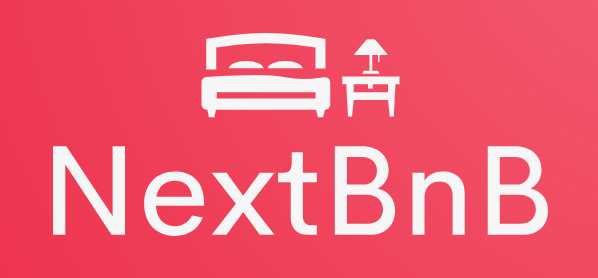
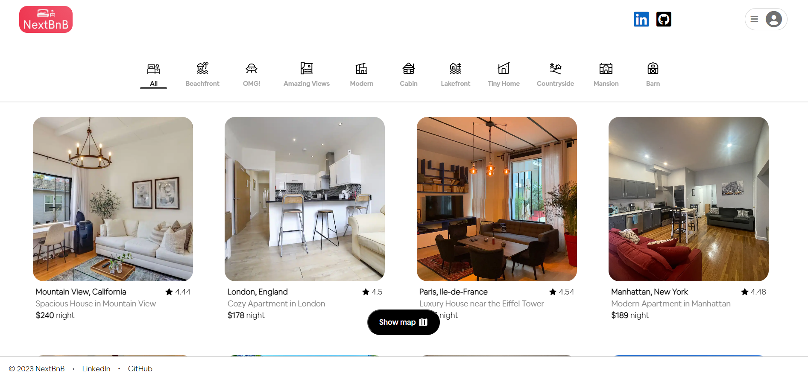
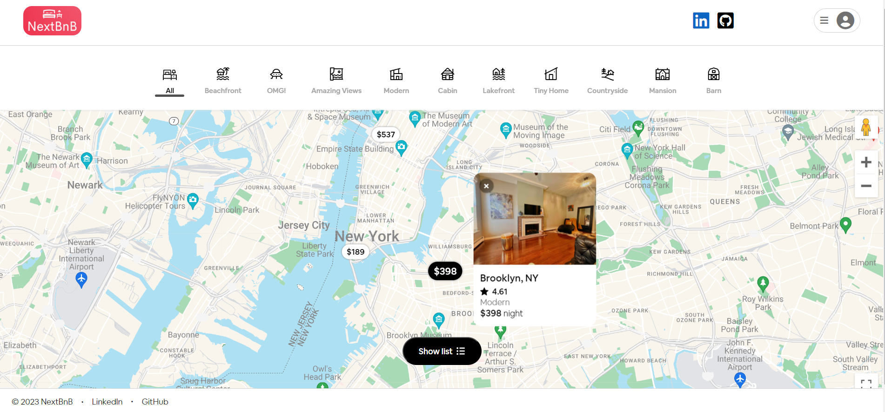
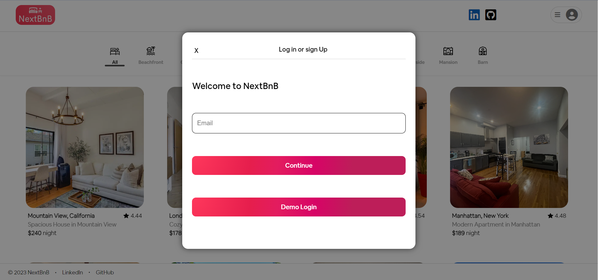
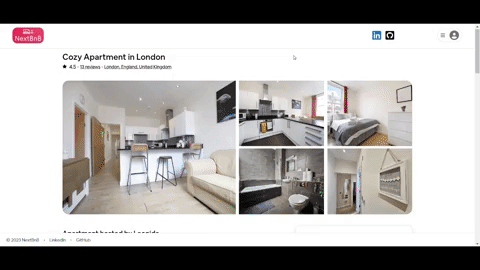

[](https://nextbnb.onrender.com/)

---
## **Background**
---

**NextBnB** is an airbnb clone, a booking platform for users who are searching for a place of stay for their next trip. Whether it be for leisure or business, there is a place for everyone, come and find your next bed & breakfast spot!

<br/>

The application was created using ReactJS as frontend and Ruby on Rails as backend.
Click [here](https://nextbnb.onrender.com/) for the live site, or click on the logo above!

<br/>

<details><summary>Site Images</summary>

> <details><summary>Main page</summary>
>
> 
> </details>

> <details><summary>Main page with map</summary>
>
> 
> </details>

> <details><summary>User sign in signup</summary>
>
> 
> </details>

> <details><summary>Listings page</summary>
>
> 
> </details>

</details>

<br/>

---
## **Technologies, Libraries, and APIs**
---
- Ruby on Rails as backend API
- React-Redux frontend
- Postgresql database
- Google Maps JS API frontend 
- react-date-range library for calendar
- Bing Maps API with geocoder gem in backend
- Node Package Manager (npm)
- Amazon Web Service (AWS)
- HTML
- CSS

<br/>

---
## **Key Features**
---

<details open>
<summary>User Authentication</summary>

* User can signup for their own account to login and logout securely
* certain features such as reserving a listing are only available to logged in user. 
</details>

<details open>
<summary>Listings</summary>

* Upon entering the site, user is taken to the home page with all the listings
* Clicking on any of the listing takes you into each individual show page where logged in users can reserve on available dates.
* Clicking a category on the top of the page will filter the listings by the specific category
</details>

<details open>
<summary>Reservations</summary>

* If the user is logged in, on the individual show page of the listing, user can select dates and book their reservation.
* Upon successfully making a reservation, user is taken to their trips page which shows all of the user's reservations, which they can access at anytime when logged in from their profile button.
* On the trips page, user can update or cancel their upcoming reservations.
</details>

<details open>
<summary>Google Maps API</summary>

* Main page has a toggle button on the bottom center of the page where the user can switch between map view or list view.
* In map view, user can click on the locations on map to have a pop up display with the that listing's basic informations.
* clicking on the pop up will also take you to that listing's page
* On each individual listing's page, there is also a map which shows the proximity of where the listing is located.
</details>

<br/>

---
## **Code Snippets**
---

<details>
<summary>Google Maps conditionally render content</summary>

```js
const MapContainer = ({ listings, center }) => {
  const { isLoaded } = useLoadScript({
    googleMapsApiKey: process.env.REACT_APP_MAPS_API_KEY,
  });
  const [activeMarker, setActiveMarker] = useState(null);

  const defaultCenter = center ? center : { lat: 40.770124, lng: -73.993277 };
  const isActiveMarker = useMemo(() => activeMarker, [activeMarker]);
  const mapCenter = useMemo(() => defaultCenter, []);

  if (!isLoaded) return <LoadingPage />;

  const options = {
    styles: mapStyles,
    disableDefaultUI: true,
    streetViewControl: true,
    streetViewControlOptions: {
      position: window.google.maps.ControlPosition.TOP_RIGHT,
    },
    zoomControl: true,
    zoomControlOptions: {
      position: window.google.maps.ControlPosition.RIGHT_TOP,
    },
    fullscreenControl: true,
    fullscreenControlOptions: {
      position: window.google.maps.ControlPosition.RIGHT_BOTTOM,
    },
    minZoom: 2,
    maxZoom: 16,
  };

  const handleMarkerClick = (listingId) => {
    if (activeMarker !== listingId) {
      setActiveMarker(listingId);
    } else {
      setActiveMarker(null);
    }
  };

  const circleOptions = {
    strokeColor: "#FF0000",
    strokeOpacity: 0.1,
    strokeWeight: 2,
    fillColor: "#FF0000",
    fillOpacity: 0.35,
  };

  return (
    <GoogleMap
      zoom={center ? 14 : 10}
      center={mapCenter}
      mapContainerClassName="map-container"
      options={options}
    >
      {center && (
        <>
          <Circle center={center} radius={450} options={circleOptions} />
          <OverlayView
            position={center}
            mapPaneName={OverlayView.OVERLAY_MOUSE_TARGET}
          >
            <div className="overlay-home-icon">
              <HomeIcon />
            </div>
          </OverlayView>
        </>
      )}
      {!center &&
        listings.map((listing) => {
          return (
            <OverlayView
              key={listing.id}
              position={{ lat: listing.latitude, lng: listing.longitude }}
              mapPaneName={OverlayView.OVERLAY_MOUSE_TARGET}
            >
              <ListingMarker
                listing={listing}
                isActive={isActiveMarker === listing.id}
                onClick={handleMarkerClick}
              />
            </OverlayView>
          );
        })}
    </GoogleMap>
  );
};
export default MapContainer;
```

</details>